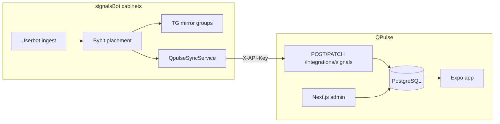

# QPulse и signalsBot (bb-trader) — экосистема для AI-агентов

Два связанных репозитория. Этот файл — **entry point в signalsBot**; зеркало и детали QPulse — в соседнем проекте.

| Проект | Путь (локально) | Назначение |
|--------|-----------------|------------|
| **signalsBot** (bb-trader) | `c:\Users\qwazi\Projects\signalsBotProd` | Торговый бот: ingest Telegram → parse → Bybit → mirror в TG-группы |
| **QPulse** | `c:\Users\qwazi\Рабочий стол\QPulse` | Мобильное приложение + админка: каталог сигналов, WS, push |

Пакетный менеджер: signalsBot — **npm**; QPulse — **pnpm**.

---

## QPulse Admin — вход

Учётная запись создаётся **Prisma seed** (`apps/api/prisma/seed.ts`):

| Поле | Значение по умолчанию |
|------|------------------------|
| Email | `admin@qpulse.app` |
| Пароль | `admin123` |

**Локально:** после `pnpm --filter api prisma db seed` → http://localhost:3000/login

**Railway (первый деплой):** переменная `RUN_SEED=true` на сервисе `qpulse-api`, затем **удалить** `RUN_SEED`. Логин тот же; пароль сменить вручную (UI смены пароля пока нет — через Prisma/повторный seed).

> Если seed не запускался или пароль меняли — дефолты выше не сработают. Не коммитить production-пароли в репозиторий.

### Разделы админки (`apps/admin`)

| Маршрут | Назначение |
|---------|------------|
| `/login` | JWT + httpOnly refresh cookie |
| `/dashboard` | Сводка: live / closed / reviews / push |
| `/signals` | Список, CRUD, batch-delete |
| `/results-summary` | Статистика по CLOSED (computed из сигналов) |
| `/home-content` | Метрики Home, fear&greed, social links |
| `/menu-links` | Пункты меню mobile |
| `/reviews` | Модерация отзывов |
| `/notifications` | Push-шаблоны и лог |
| `/settings` | Disclaimer, telegramFabUrl |
| `/client-errors` | Отчёты об ошибках с mobile |

Auth: `POST /api/v1/admin/auth/login` → Bearer access (15 мин) + refresh cookie (7 дней). Подробнее: QPulse `docs/apps/admin.md`.

---

## Как проекты связаны

### Поток сигнала

1. signalsBot парсит сообщение, **успешно размещает** ордера на Bybit (AUD-190).
2. Публикует карточку в **publish-группу** Telegram (mirror).
3. Если у группы `linkedToApp=true` и прошёл фильтр `publishEveryN` → `QpulseSyncService.createSignalIfLinked`.
4. HTTP `POST {QPULSE_API_URL}/integrations/signals` с заголовком `X-API-Key`.
5. `externalId` = `signal.id` (cuid signalsBot); связь в БД: `SignalExternalSync` (`qpulseId`, `lastError`).
6. Lifecycle (TP fill, close, SL) → `PATCH /integrations/signals/:externalId` при наличии `SignalExternalSync`.

Группа **без** `linkedToApp` → только Telegram, QPulse не трогается.

### Настройки signalsBot (per cabinet)

Ключи в `Setting` (UI: `/my-group`, только role **admin** signalsBot):

| Ключ | Описание |
|------|----------|
| `QPULSE_SYNC_ENABLED` | `true` / `false` |
| `QPULSE_API_URL` | База API, напр. `https://qpulse-api….up.railway.app/api/v1` |
| `QPULSE_API_KEY` | = `INTEGRATIONS_API_KEY` на QPulse API |

Код: `apps/api/src/modules/qpulse-sync/`, mapper: `qpulse-signal-mapper.util.ts`, события: `signal-distribution.service.ts`.

### Настройки QPulse

| Переменная (API) | Описание |
|------------------|----------|
| `INTEGRATIONS_API_KEY` | Секрет для `X-API-Key` (тот же, что `QPULSE_API_KEY` в кабинете) |
| `ADMIN_URL` | URL админки без trailing slash (CORS) |
| `JWT_SECRET` | Admin/mobile JWT (не путать с integration key) |

Интеграция **не использует** admin JWT — только machine-to-machine API key.

---

## Контракт интеграции

Полное описание: QPulse `docs/contracts/rest-api.md` → раздел **Integrations**.

| Метод | Путь | Auth |
|-------|------|------|
| POST | `/integrations/signals` | `X-API-Key` |
| PATCH | `/integrations/signals/:externalId` | `X-API-Key` |

Маппинг статусов signalsBot → QPulse:

| signalsBot | QPulse |
|------------|--------|
| PENDING, PARSED, ORDERS_PLACED (без fill) | OPEN |
| spot OPEN, futures с filled entry | ACTIVE |
| CLOSED_*, liquidation | CLOSED |
| FAILED, *CANCEL* | CANCELLED |

Поля PnL: `positionSizeUsdt`, `realizedPnlUsdt`, `profitPercentage` — см. AUD-173, AUD-192 (номинал из filled orders).

---

## Деплой и окружения

| Проект | Railway | Ветка / примечание |
|--------|---------|-------------------|
| signalsBot | `cabinets`, `production`, `test`, `ultra` | см. `.cursor/rules/railway-diagnostics-and-branches.mdc` |
| QPulse | отдельный проект Railway | `master` → production; сервисы `qpulse-api`, `qpulse-admin` |

Runbook signalsBot: `docs/audit/04-operational-runbooks.md` (§ QPulse sync).  
Runbook QPulse: `docs/runbooks/deploy-railway.md` (§ Coordinated deploy с signalsBot).

Порядок при миграциях PnL: **QPulse API** → QPulse Admin → **signalsBot API** → mobile (опционально).

---

## Где править при типичных задачах

| Задача | signalsBot | QPulse |
|--------|------------|--------|
| Текст mirror в TG | `telegram-userbot/mirror/*-format.util.ts` | — |
| % profit/loss в группе и PATCH | `qpulse-sync/qpulse-signal-mapper.util.ts` | `packages/shared/signal-profit.util.ts` |
| Когда слать в QPulse | `telegram-userbot-ingest-pipeline.service.ts`, `telegram-userbot-mirror.service.ts` | — |
| Приём external сигналов | — | `integrations/integrations-signals.controller.ts`, `signals.service.ts` |
| UI «Моя группа» / linkedToApp | `apps/web/app/my-group/page.tsx` | — |
| Admin CRUD / Results | — | `apps/admin/src/app/(protected)/*` |

---

## Ссылки

- QPulse AGENTS: `c:\Users\qwazi\Рабочий стол\QPulse\AGENTS.md`
- QPulse ↔ signalsBot: `c:\Users\qwazi\Рабочий стол\QPulse\docs\integrations\signalsbot.md`
- signalsBot AGENTS: `AGENTS.md` (секция QPulse)
- AUD-171…192: `docs/audit/06-progress-tracker.md`
